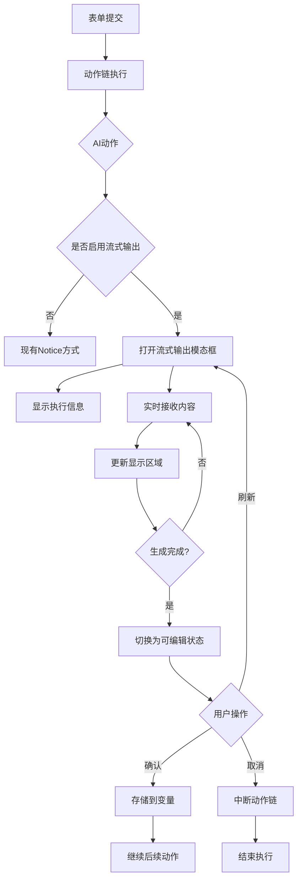
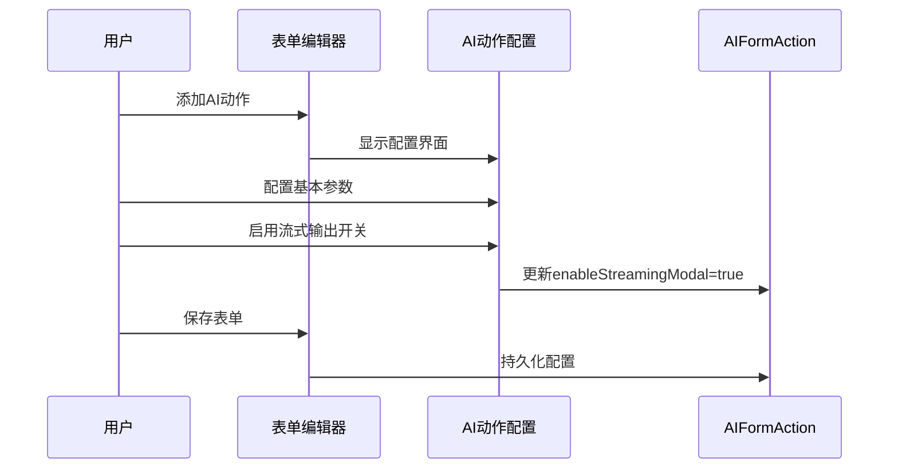
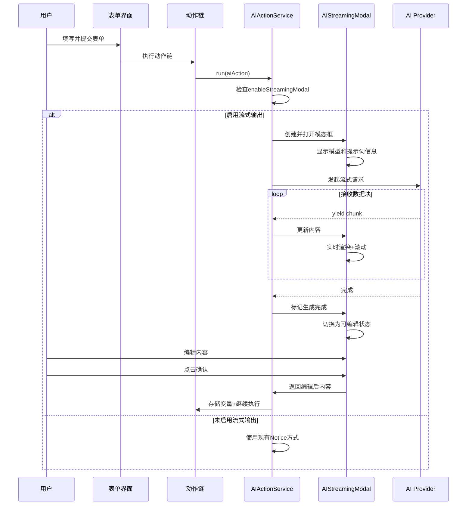
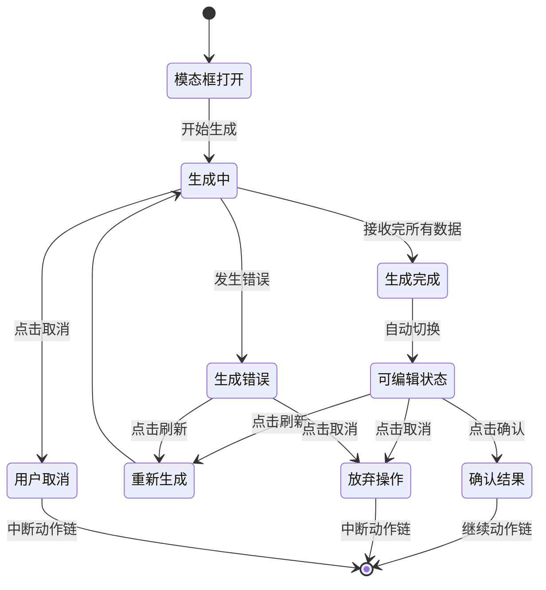

# AI动作流式输出功能设计文档

## 功能概述

为表单系统中的AI动作增加流式输出功能,通过专用模态框实时展示AI生成过程,取代现有的简单通知提示方式。用户可查看模型信息、提示词内容、实时生成进度,并在生成完成后直接编辑内容。

### 核心价值
- **提升用户体验**: 用户可实时查看AI生成内容,无需等待完整响应
- **增强透明度**: 显示使用的模型、提示词等执行信息
- **提供编辑能力**: 生成完成后支持直接编辑,提高内容处理效率
- **增强可控性**: 支持中途取消、重新生成等交互操作

## 系统架构设计

### 整体架构



### 模块分层

模态框组件层级:

```
AIStreamingModal (基于Modal)
├── 标题栏区域
│   ├── 标题文本 (AI生成中...)
│   └── 字符计数显示
├── 信息栏区域
│   ├── 模型型号显示
│   ├── 提示词名称显示 (带悬浮提示)
│   └── 实时字符统计
├── 内容显示区域
│   ├── 流式内容渲染
│   ├── 自动滚动控制
│   └── 编辑状态切换
└── 控制按钮区域
    ├── 刷新按钮
    ├── 确认按钮
    └── 取消按钮
```

## 数据模型设计

### AIFormAction扩展

在现有AIFormAction模型基础上新增配置字段:

| 字段名 | 类型 | 默认值 | 说明 |
|--------|------|--------|------|
| enableStreamingModal | boolean | false | 是否启用流式输出模态框 |

### 流式输出状态

模态框内部维护的状态信息:

| 状态字段 | 类型 | 说明 |
|----------|------|------|
| isGenerating | boolean | 是否正在生成内容 |
| accumulatedContent | string | 已累积的生成内容 |
| characterCount | number | 当前字符总数 |
| isEditable | boolean | 内容是否处于可编辑状态 |
| modelInfo | string | 使用的模型信息 |
| promptInfo | string | 提示词显示信息 |
| fullPrompt | string | 完整提示词内容(用于悬浮提示) |
| controller | AbortController | 请求中止控制器 |

### 国际化文本

需要在i18n系统中新增的文本键:

**中文(zh.ts):**
```
ai_enable_streaming_modal: "启用流式输出模态框"
ai_enable_streaming_modal_desc: "开启后AI执行时将显示实时输出模态框,可查看生成过程"
ai_streaming_modal_title: "AI生成中..."
ai_streaming_modal_title_completed: "AI生成完成"
ai_streaming_model_label: "模型"
ai_streaming_prompt_label: "提示词"
ai_streaming_prompt_custom: "自定义提示词"
ai_streaming_char_count: "字符数"
ai_streaming_btn_refresh: "刷新"
ai_streaming_btn_confirm: "确认"
ai_streaming_btn_cancel: "取消"
ai_streaming_generating: "生成中..."
ai_streaming_error_title: "生成错误"
ai_streaming_connection_error: "连接失败,正在重试..."
ai_streaming_cancelled: "生成已取消"
ai_streaming_hover_prompt_title: "完整提示词"
```

**英文(en.ts):**
```
ai_enable_streaming_modal: "Enable Streaming Output Modal"
ai_enable_streaming_modal_desc: "When enabled, AI execution will show a real-time output modal"
ai_streaming_modal_title: "AI Generating..."
ai_streaming_modal_title_completed: "AI Generation Completed"
ai_streaming_model_label: "Model"
ai_streaming_prompt_label: "Prompt"
ai_streaming_prompt_custom: "Custom Prompt"
ai_streaming_char_count: "Characters"
ai_streaming_btn_refresh: "Refresh"
ai_streaming_btn_confirm: "Confirm"
ai_streaming_btn_cancel: "Cancel"
ai_streaming_generating: "Generating..."
ai_streaming_error_title: "Generation Error"
ai_streaming_connection_error: "Connection failed, retrying..."
ai_streaming_cancelled: "Generation cancelled"
ai_streaming_hover_prompt_title: "Full Prompt"
```

## 界面设计

### 配置界面(AISetting.tsx)

在现有AI动作配置界面中,"输出变量名称"配置项之后新增:

**开关组件布局:**
```
[CpsFormItem]
├── Label: "启用流式输出模态框"
├── Description: "开启后AI执行时将显示实时输出模态框,可查看生成过程"
└── Control: [Toggle组件]
    └── Value: action.enableStreamingModal
```

### 流式输出模态框(AIStreamingModal)

**整体布局结构:**

```
┌─────────────────────────────────────────┐
│ [标题] AI生成中...        字符数: 1234 │
├─────────────────────────────────────────┤
│ 模型: GPT-4  │  提示词: [模板名]⓵  │ 1234字符 │
├─────────────────────────────────────────┤
│                                         │
│  [内容显示区域]                          │
│   - 大字号等宽字体                       │
│   - 实时滚动显示                         │
│   - Markdown格式渲染                    │
│   - 完成后可编辑                         │
│                                         │
│                                         │
├─────────────────────────────────────────┤
│  [刷新]    [确认]    [取消]              │
└─────────────────────────────────────────┘

⓵ = 鼠标悬停显示完整提示词内容
```

**样式规范:**

| 区域 | 样式属性 | 值/说明 |
|------|----------|--------|
| 模态框容器 | 最大宽度 | 80vw |
| 模态框容器 | 最大高度 | 85vh |
| 标题栏 | 字体大小 | var(--font-ui-medium) |
| 标题栏 | 背景色 | var(--background-secondary) |
| 信息栏 | 高度 | 40px |
| 信息栏 | 边框 | var(--background-modifier-border) |
| 内容区域 | 最大高度 | 70vh |
| 内容区域 | 字体 | var(--font-monospace) |
| 内容区域 | 字体大小 | var(--font-ui-medium) |
| 内容区域 | 背景色 | var(--background-primary-alt) |
| 内容区域 | 内边距 | 16px |
| 内容区域(编辑) | 边框色 | var(--interactive-accent) |
| 按钮区域 | 间距 | 8px |
| 按钮 | 高度 | 36px |
| 按钮 | 圆角 | var(--radius-m) |

### 交互状态

**按钮状态矩阵:**

| 阶段 | 刷新按钮 | 确认按钮 | 取消按钮 | 说明 |
|------|----------|----------|----------|------|
| 生成中 | 禁用 | 禁用(显示"生成中...") | 启用 | 允许中途取消 |
| 生成完成 | 启用 | 启用 | 启用 | 所有操作可用 |
| 错误状态 | 启用 | 禁用 | 启用 | 可重试或取消 |
| 编辑中 | 启用 | 启用 | 启用 | 支持所有操作 |

**内容区域状态:**

| 状态 | 光标 | 边框 | 背景 | 可操作性 |
|------|------|------|------|----------|
| 生成中 | 默认 | 1px solid border | 浅灰 | 只读 |
| 完成未编辑 | 文本光标 | 2px solid accent | 浅灰 | 可编辑 |
| 编辑中 | 文本光标 | 2px solid accent | 白色 | 可编辑 |
| 错误状态 | 默认 | 1px solid error | 浅红 | 只读 |

## 功能流程设计

### 配置阶段流程



### 执行阶段流程



### 用户交互流程

**主流程:**


## 核心实现策略

### AIActionService改造

**callAI方法职责分离:**

现有callAI方法承担所有AI调用逻辑,需要进行职责分离:

```
callAI(原有方法)
├── callAIWithNotice(使用Notice方式)
│   └── 现有实现逻辑
└── callAIWithModal(使用模态框方式)
    ├── 创建AIStreamingModal实例
    ├── 配置模态框参数
    ├── 打开模态框
    ├── 流式接收并更新
    └── 等待用户操作结果
```

**决策逻辑:**
```
if (aiAction.enableStreamingModal === true) {
    return await callAIWithModal(...);
} else {
    return await callAIWithNotice(...);
}
```

### AIStreamingModal实现

**继承结构:**
```
Modal (Obsidian)
  ↓
AIStreamingModal (新组件)
```

**核心方法:**

| 方法名 | 职责 | 返回值 |
|--------|------|--------|
| constructor | 初始化模态框,接收配置参数 | void |
| onOpen | 创建DOM结构,初始化UI | void |
| startStreaming | 启动流式数据接收 | Promise<string> |
| updateContent | 更新内容显示区域 | void |
| onStreamComplete | 处理生成完成逻辑 | void |
| enableEditing | 切换为可编辑状态 | void |
| handleRefresh | 处理刷新按钮点击 | void |
| handleConfirm | 处理确认按钮点击 | void |
| handleCancel | 处理取消按钮点击 | void |
| onClose | 清理资源 | void |

**数据流转:**

```
AI Provider Stream
  ↓ (for await...of)
AIActionService.callAIWithModal
  ↓ (调用)
AIStreamingModal.updateContent
  ↓ (更新DOM)
内容显示区域
  ↓ (用户编辑)
可编辑文本区域
  ↓ (点击确认)
Promise resolve(编辑后内容)
  ↓ (返回)
AIActionService
  ↓ (存储)
context.state.values[outputVariable]
```

### 提示词信息获取

**提示词显示策略:**

| 提示词来源 | 显示文本 | 悬浮提示内容 |
|-----------|---------|-------------|
| 内置模板(TEMPLATE) | 模板文件名(去除路径和扩展名) | 完整提示词内容 |
| 自定义提示(CUSTOM) | "自定义提示词" | 完整提示词内容 |

**实现逻辑:**
```
function getPromptDisplayInfo(aiAction: AIFormAction, processedPrompt: string) {
    if (aiAction.promptSource === PromptSourceType.TEMPLATE) {
        const fileName = extractFileName(aiAction.templateFile);
        return {
            displayText: fileName,
            fullContent: processedPrompt
        };
    } else {
        return {
            displayText: localInstance.ai_streaming_prompt_custom,
            fullContent: processedPrompt
        };
    }
}

function extractFileName(filePath: string): string {
    处理逻辑:
    1. 移除文件夹路径部分
    2. 移除.md扩展名
    3. 返回文件名
}
```

### 内容编辑实现

**从只读到可编辑的转换:**

生成完成时的处理流程:
```
1. 检测流式数据接收完毕
2. 更新模态框标题: "AI生成中..." → "AI生成完成"
3. 内容区域转换:
   - 原div元素 → textarea元素
   - 保持已生成的完整内容
   - 设置可编辑属性
   - 更新边框样式
4. 按钮状态更新:
   - 确认按钮: 禁用 → 启用
   - 刷新按钮: 保持启用
5. 聚焦到编辑区域
```

**编辑器配置:**
- 使用textarea元素(保持简单,避免复杂编辑器依赖)
- 继承内容区域的等宽字体样式
- 支持多行文本编辑
- 支持快捷键(Ctrl/Cmd+A全选等)
- 不实现Markdown实时预览(保持简单)

### 错误处理策略

**错误类型处理矩阵:**

| 错误类型 | 检测方式 | 显示方式 | 可用操作 |
|---------|---------|---------|----------|
| 网络连接错误 | catch网络异常 | 内容区显示错误信息 | 刷新、取消 |
| AI服务错误 | catch API错误 | 内容区显示错误信息+建议 | 刷新、取消 |
| 用户中止请求 | AbortController | 显示"生成已取消" | 刷新、取消 |
| 模型不支持 | 特定错误消息匹配 | 显示模型限制说明 | 取消 |
| 空响应 | 响应内容长度检查 | 显示"AI返回内容为空" | 刷新、取消 |

**错误恢复机制:**
```
错误发生时:
1. 中止当前请求(controller.abort)
2. 保留已接收的部分内容
3. 在内容区域显示错误信息
4. 启用刷新按钮允许重试
5. 记录错误到调试日志

刷新操作:
1. 清空内容区域
2. 重置状态为"生成中"
3. 创建新的AbortController
4. 重新发起流式请求
```

### 性能优化策略

**DOM更新优化:**

```
策略1: 批量更新
- 设置更新间隔(例如100ms)
- 缓冲接收到的多个chunk
- 一次性更新DOM

策略2: 防抖字符计数
- 字符计数更新使用防抖
- 避免每个chunk都触发计数更新

策略3: 虚拟滚动(可选)
- 仅在内容超过一定长度时启用
- 只渲染可视区域的内容
```

**内存管理:**
```
1. 及时清理AbortController
2. 模态框关闭时清理所有事件监听器
3. 长文本内容使用流式追加而非全量替换
4. 避免在内存中保留多个版本的完整内容
```

**实现示例:**
```
使用更新间隔控制:
let updateBuffer = "";
let lastUpdateTime = 0;
const UPDATE_INTERVAL = 100; // 毫秒

for await (const chunk of stream) {
    updateBuffer += chunk;
    const now = Date.now();
    
    if (now - lastUpdateTime >= UPDATE_INTERVAL) {
        modal.updateContent(updateBuffer);
        updateBuffer = "";
        lastUpdateTime = now;
    }
}

确保最后一次更新:
if (updateBuffer.length > 0) {
    modal.updateContent(updateBuffer);
}
```

## 集成方案

### 与现有代码集成点

**1. 数据模型集成 (AIFormAction.ts)**
```
修改位置: AIFormAction类定义
修改类型: 新增字段
字段定义:
  enableStreamingModal?: boolean;
默认值: undefined (向后兼容,未定义时视为false)
```

**2. 配置界面集成 (AISetting.tsx)**
```
插入位置: "输出变量名称"配置项之后
组件类型: CpsFormItem + Toggle
布局方式: 与其他配置项保持一致的horizontal布局
数据绑定: value={action.enableStreamingModal || false}
          onChange={(value) => handleActionChange({ enableStreamingModal: value })}
```

**3. 业务逻辑集成 (AIActionService.ts)**
```
修改方法: run方法
修改位置: 步骤3 "调用AI并获取响应"之前
集成逻辑:
  const aiAction = action as AIFormAction;
  
  if (aiAction.enableStreamingModal) {
      const response = await this.callAIWithModal(...);
  } else {
      const response = await this.callAI(...); // 现有逻辑
  }
```

**4. 国际化集成 (zh.ts, en.ts)**
```
插入位置: AI相关文本区域(ai_*键之后)
命名规范: 使用ai_streaming_*前缀
总计条目: 约15条新增文本键
```

### 文件结构

**新增文件:**
```
plugin/src/component/modal/
  └── AIStreamingModal.tsx        (流式输出模态框组件)
  └── AIStreamingModal.css        (模态框样式)
```

**修改文件:**
```
plugin/src/model/action/
  └── AIFormAction.ts              (添加enableStreamingModal字段)

plugin/src/service/action/ai/
  └── AIActionService.ts           (添加callAIWithModal方法)

plugin/src/view/edit/setting/action/ai/
  └── AISetting.tsx                (添加流式输出开关)

plugin/src/i18n/
  ├── zh.ts                        (添加中文文本)
  ├── en.ts                        (添加英文文本)
  └── zhTw.ts                      (添加繁体中文文本)
```

### 向后兼容性

**兼容性保证:**

1. **字段默认值**: enableStreamingModal默认为false或undefined,不影响现有表单
2. **逻辑分支**: 仅当明确启用时才使用新模态框,否则使用现有Notice方式
3. **配置保存**: 老版本表单打开时不会自动添加此字段
4. **代码隔离**: 新功能封装在独立模块,不修改现有核心逻辑

**升级路径:**
```
用户升级插件后:
1. 现有表单继续按原方式工作(Notice提示)
2. 用户可选择性为需要的AI动作启用流式输出
3. 新创建的表单可直接配置流式输出选项
```

## 技术规格

### 组件接口定义

**AIStreamingModal构造函数:**
```
constructor(
    app: App,
    options: AIStreamingModalOptions
)

interface AIStreamingModalOptions {
    modelInfo: string;              // 模型型号信息
    promptDisplayText: string;      // 提示词显示文本
    fullPromptContent: string;      // 完整提示词内容
    streamGenerator: AsyncGenerator<string>; // 流式数据生成器
    onConfirm: (editedContent: string) => void; // 确认回调
    onCancel: () => void;          // 取消回调
    onRefresh: () => void;         // 刷新回调
    controller: AbortController;    // 请求控制器
}
```

**callAIWithModal方法签名:**
```
private async callAIWithModal(
    provider: any,
    messages: Message[],
    context: ActionContext,
    aiAction: AIFormAction,
    userPrompt: string
): Promise<string>
```

### 状态管理

**模态框内部状态:**
```
interface ModalState {
    phase: 'generating' | 'completed' | 'error' | 'editing'; // 当前阶段
    content: string;              // 累积内容
    characterCount: number;       // 字符计数
    errorMessage?: string;        // 错误信息
    isEditable: boolean;          // 是否可编辑
}
```

**状态转换规则:**
```
generating → completed: 流式数据接收完毕
generating → error: 捕获异常
generating → cancelled: 用户点击取消
completed → editing: 自动转换(UI表现为可编辑)
any → generating: 点击刷新按钮
```

### 样式规范

**CSS类命名约定:**
```
.ai-streaming-modal                    // 模态框容器
.ai-streaming-modal__header            // 标题栏
.ai-streaming-modal__header-title      // 标题文本
.ai-streaming-modal__header-count      // 字符计数
.ai-streaming-modal__info-bar          // 信息栏
.ai-streaming-modal__info-model        // 模型信息
.ai-streaming-modal__info-prompt       // 提示词信息
.ai-streaming-modal__content           // 内容区域
.ai-streaming-modal__content--generating  // 生成中状态
.ai-streaming-modal__content--editable    // 可编辑状态
.ai-streaming-modal__content--error       // 错误状态
.ai-streaming-modal__controls          // 控制按钮区
.ai-streaming-modal__btn-refresh       // 刷新按钮
.ai-streaming-modal__btn-confirm       // 确认按钮
.ai-streaming-modal__btn-cancel        // 取消按钮
```

**响应式设计:**
```
桌面端 (>768px):
- 模态框宽度: 80vw
- 内容区最大高度: 70vh
- 三栏信息栏布局

移动端 (≤768px):
- 模态框宽度: 95vw
- 内容区最大高度: 60vh
- 信息栏垂直堆叠
- 按钮全宽度布局
```

### 辅助功能(Accessibility)

**键盘支持:**
```
Esc键: 触发取消操作
Ctrl/Cmd + Enter: 触发确认操作
Ctrl/Cmd + R: 触发刷新操作
Tab键: 在按钮间切换焦点
```

**ARIA属性:**
```
模态框: role="dialog" aria-modal="true" aria-labelledby="modal-title"
内容区: role="textbox" aria-multiline="true" aria-readonly根据状态动态设置
按钮: aria-label提供明确的操作说明
字符计数: aria-live="polite" 实时播报更新
```

**屏幕阅读器支持:**
```
1. 模态框打开时自动聚焦到标题
2. 生成过程中周期性播报进度
3. 生成完成时播报"生成完成,内容可编辑"
4. 按钮状态变化时播报
```

## 测试策略

### 功能测试场景

**配置阶段测试:**

| 测试场景 | 操作步骤 | 预期结果 |
|---------|---------|----------|
| 开关显示 | 打开AI动作配置 | 在输出变量名称下方显示流式输出开关 |
| 开关切换 | 点击开关 | enableStreamingModal值正确切换 |
| 配置保存 | 启用开关后保存表单 | 配置正确持久化到表单文件 |
| 配置加载 | 重新打开已配置表单 | 开关状态正确恢复 |

**执行阶段测试:**

| 测试场景 | 操作步骤 | 预期结果 |
|---------|---------|----------|
| 模态框打开 | 提交启用流式输出的表单 | 模态框正确打开并显示信息 |
| 实时显示 | 观察生成过程 | 内容实时追加,字符数实时更新 |
| 滚动行为 | 生成长文本 | 自动滚动到底部显示最新内容 |
| 生成完成 | 等待生成结束 | 标题变化,内容变为可编辑 |
| 内容编辑 | 修改生成的文本 | 编辑操作正常,界面有视觉反馈 |
| 确认操作 | 点击确认按钮 | 内容存储到变量,继续后续动作 |
| 取消操作 | 点击取消按钮 | 模态框关闭,动作链中断 |
| 刷新操作 | 点击刷新按钮 | 清空内容,重新开始生成 |

**边界条件测试:**

| 测试场景 | 触发条件 | 预期行为 |
|---------|---------|----------|
| 空响应 | AI返回空内容 | 显示"AI返回内容为空"错误 |
| 超长内容 | 生成10000+字符 | 滚动条正常,性能流畅 |
| 网络中断 | 生成中断开网络 | 显示连接错误,刷新按钮可用 |
| 快速取消 | 开始后立即取消 | 请求正确中止,无内存泄漏 |
| 多次刷新 | 连续点击刷新 | 上次请求正确取消,新请求正常 |
| 未编辑确认 | 生成完成不编辑直接确认 | 原始内容正确存储 |
| 清空内容 | 编辑时删除所有内容后确认 | 存储空字符串到变量 |

### 兼容性测试

**模型兼容性:**
```
测试不同AI提供商:
- OpenAI (GPT系列)
- Qwen (通义千问)
- Doubao (豆包)
- Azure OpenAI
- 其他支持的提供商

验证点:
- 流式数据正确接收
- 特殊格式正确处理(如推理标记)
- 错误信息正确显示
```

**提示词兼容性:**
```
测试不同提示词来源:
- 使用内置模板
- 使用自定义提示词
- 包含变量的提示词
- 超长提示词

验证点:
- 提示词信息正确显示
- 悬浮提示正确展示完整内容
- 变量正确替换
```

**Obsidian版本兼容性:**
```
测试版本:
- 最低支持版本: 1.8.0
- 当前稳定版本
- 最新内测版本

验证点:
- Modal API正常工作
- 样式变量正确应用
- 没有API弃用警告
```

### 性能测试

**性能指标:**

| 指标 | 目标值 | 测试方法 |
|------|--------|----------|
| 模态框打开延迟 | <100ms | 测量从调用到显示的时间 |
| 内容更新延迟 | <50ms | 测量从接收chunk到DOM更新的时间 |
| 大文本滚动流畅度 | 60fps | 监控滚动时的帧率 |
| 内存占用 | <50MB增量 | 监控生成10000字时的内存变化 |
| CPU占用 | <10%峰值 | 监控生成过程中的CPU使用率 |

**压力测试场景:**
```
1. 极长文本生成:
   - 生成50000+字符的内容
   - 监控内存和性能
   - 验证滚动和编辑仍然流畅

2. 快速数据流:
   - 模拟高频率chunk接收(每10ms一个)
   - 验证UI更新不会阻塞
   - 确认没有丢失数据

3. 多次重复操作:
   - 连续刷新生成20次
   - 验证没有内存泄漏
   - 确认性能不会退化
```

## 实施计划

### 开发阶段划分

**阶段1: 基础架构 (预计2-3天)**
```
任务:
1. 创建AIStreamingModal组件骨架
2. 定义组件接口和数据结构
3. 实现基本的DOM结构和布局
4. 添加基础样式(无交互)

交付物:
- AIStreamingModal.tsx (静态组件)
- AIStreamingModal.css (基础样式)
- 接口定义完成
```

**阶段2: 流式数据集成 (预计2-3天)**
```
任务:
1. 在AIActionService中实现callAIWithModal方法
2. 集成流式数据生成器
3. 实现实时内容更新逻辑
4. 添加字符计数和滚动控制

交付物:
- AIActionService.callAIWithModal方法
- 流式数据正确显示
- 性能优化初步实现
```

**阶段3: 交互功能 (预计2天)**
```
任务:
1. 实现编辑功能(生成完成后可编辑)
2. 实现三个按钮的逻辑(确认、取消、刷新)
3. 实现状态转换逻辑
4. 添加错误处理

交付物:
- 完整的用户交互功能
- 错误处理机制
- 状态管理完善
```

**阶段4: 配置界面 (预计1天)**
```
任务:
1. 在AISetting.tsx中添加流式输出开关
2. 修改AIFormAction模型添加字段
3. 实现配置保存和加载
4. 测试配置功能

交付物:
- 配置界面完成
- 数据模型更新
- 配置持久化正常
```

**阶段5: 国际化和样式 (预计1天)**
```
任务:
1. 添加所有需要的国际化文本
2. 完善样式细节(悬浮提示、状态样式等)
3. 实现响应式布局
4. 添加辅助功能支持

交付物:
- 国际化文本完整
- 样式打磨完成
- 辅助功能支持
```

**阶段6: 测试和优化 (预计2-3天)**
```
任务:
1. 功能测试(按测试场景执行)
2. 兼容性测试(不同模型和版本)
3. 性能测试和优化
4. Bug修复

交付物:
- 测试报告
- 性能优化完成
- 所有已知Bug修复
```

### 风险评估

| 风险点 | 影响 | 概率 | 应对措施 |
|--------|------|------|----------|
| 流式数据性能问题 | 高 | 中 | 实施批量更新和防抖策略 |
| 不同模型返回格式差异 | 中 | 中 | 充分测试各提供商,抽象处理逻辑 |
| 编辑功能体验不佳 | 中 | 低 | 提供清晰的视觉反馈和操作指引 |
| 内存泄漏 | 高 | 低 | 严格的资源清理机制和测试 |
| 与现有代码冲突 | 高 | 低 | 充分的集成测试和向后兼容性保证 |

### 质量保证

**Code Review检查点:**
```
1. 代码结构:
   - 职责单一,模块化清晰
   - 避免过长方法(控制在100行以内)
   - 合理的抽象和复用

2. 错误处理:
   - 所有异步操作有try-catch
   - 用户友好的错误提示
   - 完善的日志记录

3. 性能:
   - 没有不必要的重复计算
   - DOM操作最小化
   - 及时清理资源

4. 可维护性:
   - 清晰的注释和文档
   - 统一的命名和格式
   - 易于扩展的设计
```

**发布前检查清单:**
```
□ 所有功能测试场景通过
□ 所有边界条件测试通过
□ 性能指标达到目标值
□ 国际化文本完整且正确
□ 样式在浅色和深色主题下都正常
□ 代码通过ESLint检查
□ TypeScript类型定义完整无错误
□ 没有控制台错误或警告
□ 向后兼容性验证通过
□ 文档更新完成
```

## 未来扩展可能

### 可选增强功能

这些功能不在当前范围内,但为未来扩展预留设计空间:

**1. Markdown实时预览**
```
功能描述:
- 在内容区域下方增加预览标签页
- 实时渲染Markdown格式
- 支持编辑/预览模式切换

设计预留:
- 内容区域使用独立组件封装
- 预留切换UI的位置
```

**2. 生成历史记录**
```
功能描述:
- 记录每次生成的内容
- 支持查看和恢复历史版本
- 比较不同版本的差异

设计预留:
- 在确认前保存到临时存储
- 模态框侧边栏预留历史列表位置
```

**3. 流式生成暂停/恢复**
```
功能描述:
- 允许用户暂停接收数据
- 支持恢复继续接收
- 适用于需要仔细查看的场景

设计预留:
- AbortController改为支持暂停的控制器
- 按钮区预留暂停按钮位置
```

**4. 内容导出功能**
```
功能描述:
- 支持导出为Markdown文件
- 支持复制到剪贴板
- 支持多种格式导出

设计预留:
- 控制栏预留导出按钮位置
- 提取内容处理为独立方法
```

### 扩展性考虑

**组件化设计:**
```
AIStreamingModal可分解为:
- StreamingHeader (标题栏组件)
- StreamingInfoBar (信息栏组件)
- StreamingContent (内容区域组件)
- StreamingControls (控制按钮组件)

好处:
- 便于单独测试
- 易于替换和扩展
- 提高代码复用性
```

**插件系统:**
```
预留插件钩子:
- onBeforeStreamStart: 流式开始前
- onChunkReceived: 接收到数据块时
- onStreamComplete: 流式完成时
- onContentEdit: 内容编辑时

应用场景:
- 内容过滤和转换
- 自定义格式处理
- 集成第三方服务
```

---

**文档版本**: 1.0
**最后更新**: 2025年
**设计状态**: 待审核
