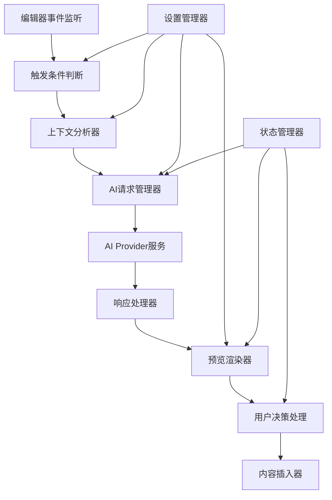
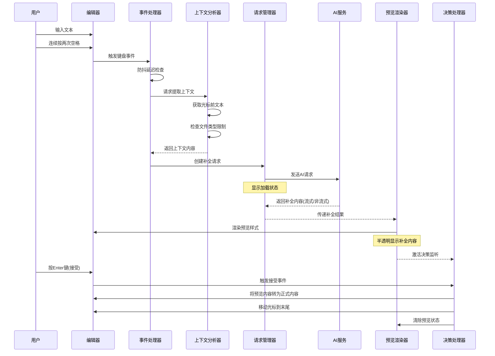
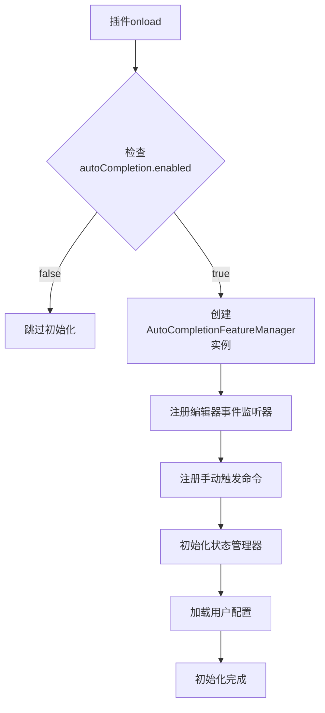
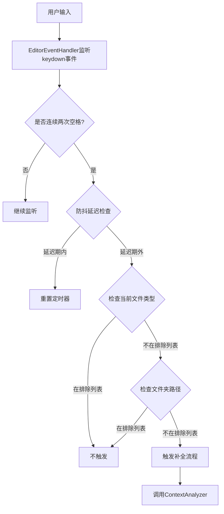
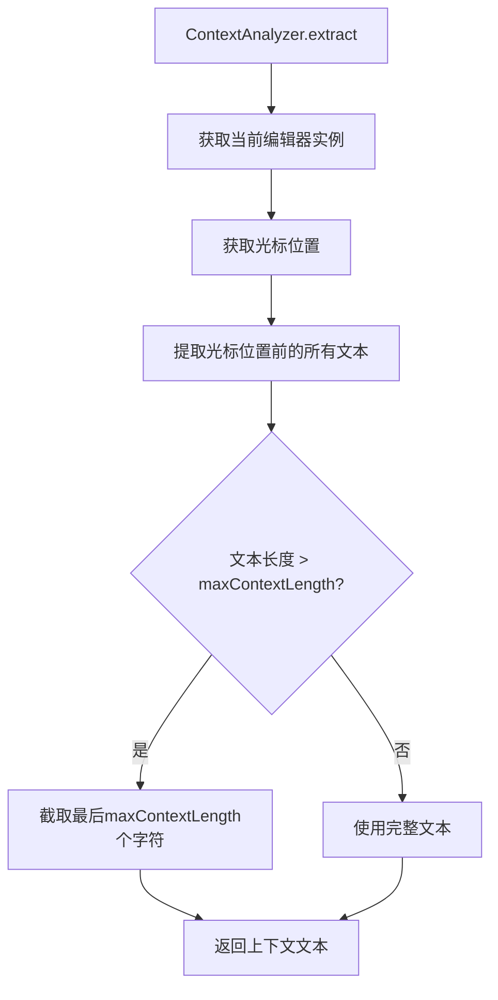
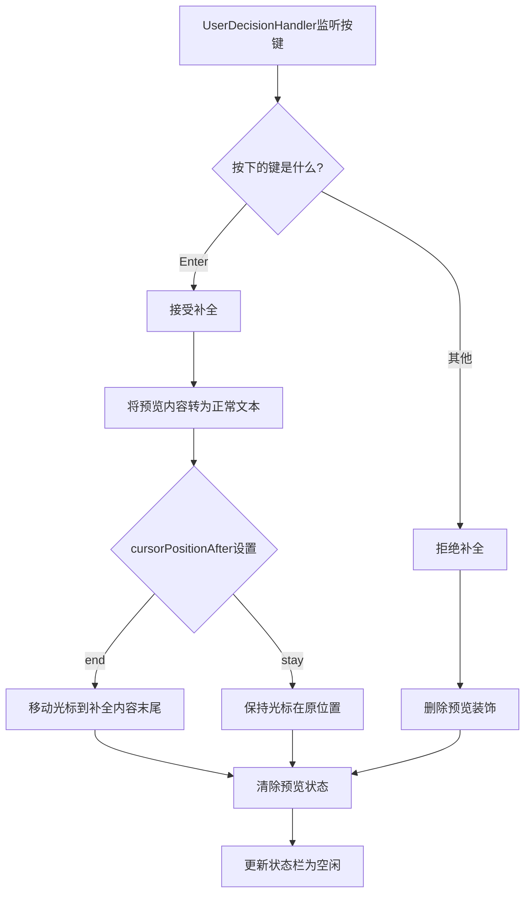
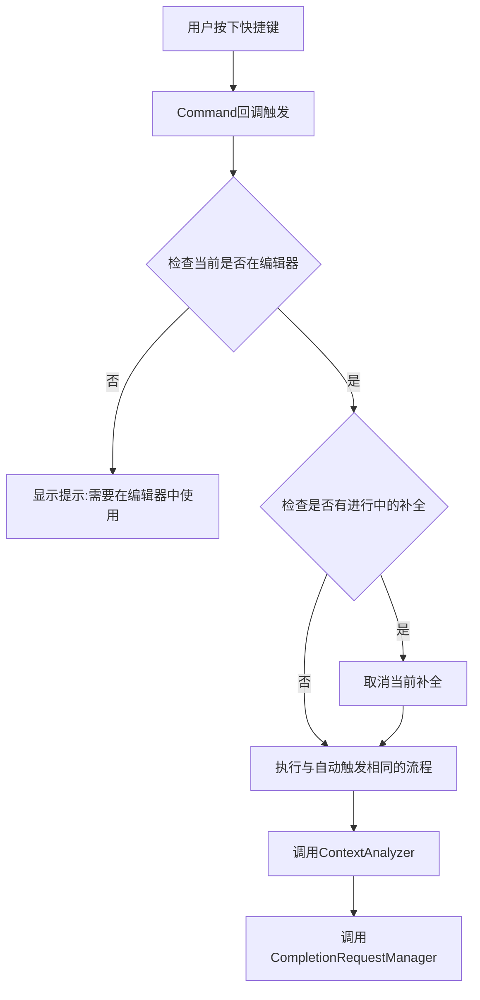
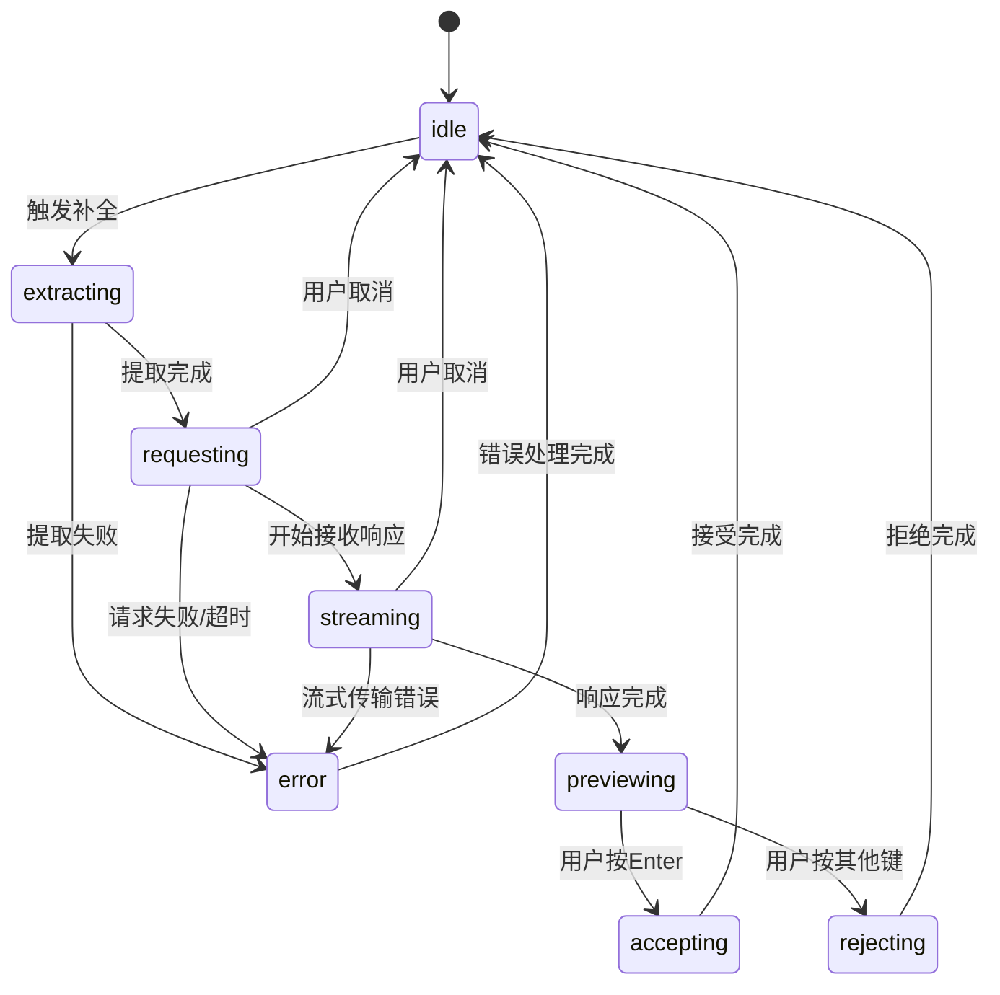
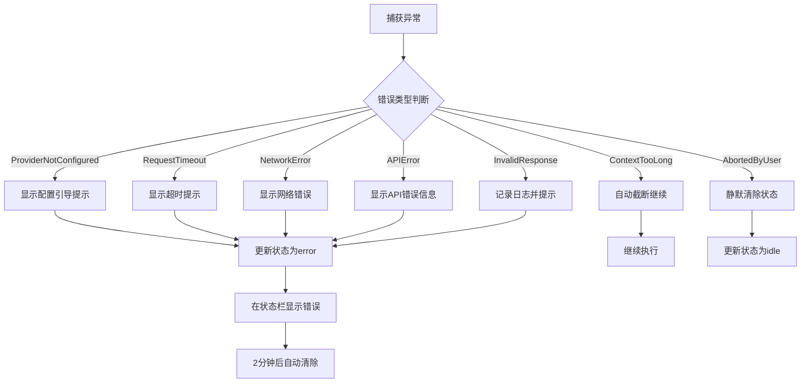

# AI自动补全功能设计文档

## 一、功能概述

AI自动补全功能是一个集成在Obsidian编辑器中的智能文本补全辅助系统。该功能通过分析用户当前输入的上下文内容,利用AI模型预测并生成后续文本建议,用户可以选择接受或拒绝这些补全内容。

### 核心价值

- 提升写作效率,减少重复性输入工作
- 提供智能文本续写建议,激发写作灵感
- 支持自定义配置,适应不同的写作场景和个人偏好
- 无缝集成到Obsidian编辑体验中,不干扰正常工作流

### 功能边界

- 仅提供文本补全建议,不自动修改已有内容
- 专注于markdown笔记场景,不处理其他文件类型(可配置)
- 补全内容以预览形式显示,用户完全控制是否接受
- 不涉及内容审查或编辑建议功能

## 二、系统架构设计

### 2.1 整体架构



### 2.2 模块划分

#### 2.2.1 核心模块

**AutoCompletionFeatureManager** - 功能管理器
- 职责:功能的生命周期管理,包括初始化、启用、禁用、销毁
- 协调各子模块的工作流程
- 管理全局状态和资源清理

**EditorEventHandler** - 编辑器事件处理器
- 职责:监听编辑器中的键盘事件和输入事件
- 识别触发条件(双空格触发、手动触发快捷键)
- 防抖控制,避免频繁触发请求

**ContextAnalyzer** - 上下文分析器
- 职责:提取光标位置前的文本内容作为上下文
- 根据配置限制上下文长度
- 支持排除特定文件类型或路径

**CompletionRequestManager** - 补全请求管理器
- 职责:构造AI请求参数
- 管理请求生命周期(发送、取消、超时)
- 处理请求队列,避免重复请求

**PreviewRenderer** - 预览渲染器
- 职责:在编辑器中渲染补全内容的预览效果
- 应用视觉样式(半透明、颜色、背景)
- 管理预览内容的显示和清除

**UserDecisionHandler** - 用户决策处理器
- 职责:监听用户的接受或拒绝操作
- 根据用户决策执行相应动作
- 管理光标位置

**StatusIndicator** - 状态指示器
- 职责:在状态栏显示功能状态
- 提供视觉反馈(加载中、等待确认、错误)
- 管理状态消息的显示和隐藏

#### 2.2.2 配置模块

**AutoCompletionSettings** - 自动补全设置
- 定义所有配置项的数据结构
- 提供默认配置值
- 与插件主设置集成

**AutoCompletionSettingTab** - 自动补全设置页
- 渲染设置界面
- 处理用户配置更改
- 验证配置有效性

### 2.3 数据流设计



## 三、配置项设计

### 3.1 配置数据结构

| 配置项 | 数据类型 | 默认值 | 说明 |
|--------|---------|--------|------|
| enabled | 布尔值 | false | 是否启用自动补全功能 |
| defaultModel | 字符串 | "" | 默认使用的AI模型标识符(引用Tars配置的provider) |
| promptTemplate | 字符串 | "请根据以下上下文内容,自然地续写后续文本。只输出续写内容,不要重复上下文:\n\n{{context}}" | 补全提示词模板 |
| temperature | 数字 | 0.7 | AI生成温度参数(0-1) |
| maxTokens | 数字 | 150 | 补全内容最大长度(token数) |
| requestTimeout | 数字 | 15000 | 请求超时时间(毫秒) |
| maxContextLength | 数字 | 2000 | 最大上下文长度(字符数) |
| displayStyle | 枚举 | "transparent" | 补全显示样式:"transparent"(半透明)、"underline"(下划线)、"highlight"(高亮) |
| textColor | 字符串 | "#87CEEB" | 补全文本颜色(十六进制) |
| backgroundColor | 字符串 | "#E6F3FF" | 补全文本背景色(十六进制) |
| textOpacity | 数字 | 0.6 | 补全文本透明度(0-1) |
| autoAcceptShort | 布尔值 | false | 是否自动接受短补全(少于5个字符) |
| cursorPositionAfter | 枚举 | "end" | 补全后光标位置:"end"(末尾)、"stay"(保持) |
| debounceDelay | 数字 | 500 | 防抖延迟时间(毫秒) |
| excludeFileTypes | 字符串数组 | [] | 排除的文件扩展名列表 |
| excludeFolders | 字符串数组 | [] | 排除的文件夹路径列表 |
| manualTriggerHotkey | 热键对象 | null | 手动触发补全的快捷键 |

### 3.2 与现有设置的集成方式

在 `PluginSettings` 接口中添加新字段:

```
export interface PluginSettings {
    formFolder: string;
    scriptFolder: string;
    promptTemplateFolder: string;
    tars: TarsFeatureConfig;
    chat: ChatSettings;
    autoCompletion: AutoCompletionSettings;  // 新增
}
```

在 `DEFAULT_SETTINGS` 中添加默认值:

```
export const DEFAULT_SETTINGS: PluginSettings = {
    // ...现有配置
    autoCompletion: DEFAULT_AUTOCOMPLETION_SETTINGS
};
```

### 3.3 AI模型配置复用策略

自动补全功能不自建AI Provider配置,而是复用Tars功能中已配置的AI Provider:

- 在设置页中提供下拉选择器,列出所有已配置的provider(通过 `settings.tars.settings.providers` 获取)
- 用户选择某个provider的tag作为默认补全模型
- 发送请求时,使用选中provider的配置(apiKey、baseURL、model等)
- 如果provider列表为空,显示提示引导用户先配置Tars

## 四、用户界面设计

### 4.1 设置页面布局

在 `PluginSettingTab` 中添加新标签页"AI自动补全",位置在"AI Chat"之后:

```
{
    id: "autocompletion_setting",
    title: "AI自动补全",
    content: <AutoCompletionSettingTabItem plugin={this.plugin} />
}
```

### 4.2 设置页面分区

#### 基础功能设置区域
- 启用自动补全(Toggle开关)
- 默认补全模型(Dropdown,从Tars providers中选择)
- 补全提示词模板(Textarea,多行输入)

#### AI模型设置区域
- 温度参数(Slider,范围0-1,步长0.1)
- 补全内容最大长度(Number Input,范围10-500)
- 请求超时时间(Number Input,范围5-60秒)
- 最大上下文长度(Number Input,范围500-5000字符)

#### 交互设置区域
- 补全显示样式(Radio Group:半透明/下划线/高亮)
- 补全文本颜色(Color Picker)
- 补全文本背景色(Color Picker)
- 补全文本透明度(Slider,范围0-1)
- 自动接受短补全(Toggle开关)
- 补全后光标位置(Radio Group:补全内容末尾/保持原位)
- 防抖延迟时间(Slider,范围100-2000毫秒)

#### 高级设置区域(默认折叠)
- 排除文件类型(Text Input,逗号分隔,例如:"canvas,excalidraw")
- 排除文件夹路径(Text Input,逗号分隔,例如:"Archive,Templates")
- 手动触发快捷键(Hotkey Setter)

### 4.3 视觉规范

**颜色方案**
- 设置页背景:#f5f5f5
- 标题文字:#333333,14px,加粗
- 描述文字:#666666,12px
- 输入框边框:#CCCCCC,1px

**布局规范**
- 每个设置项占一行
- 设置名称左对齐,控件右对齐
- 区域间距:24px
- 设置项间距:16px

**交互反馈**
- 所有状态变更有0.2秒过渡动画
- Toggle开关激活时颜色:#4A90E2
- 鼠标悬停时显示提示文字

### 4.4 编辑器预览效果

**补全内容样式**(根据用户选择的显示样式):

半透明样式:
- 文字颜色:用户配置的textColor
- 背景色:用户配置的backgroundColor
- 透明度:用户配置的textOpacity
- 左侧AI图标:16x16像素,蓝色(#4A90E2)

下划线样式:
- 文字颜色:继承编辑器颜色
- 下划线:2px虚线,颜色为textColor
- 无背景色

高亮样式:
- 文字颜色:继承编辑器颜色
- 背景色:backgroundColor
- 透明度:textOpacity

**分隔线**:
- 补全内容与原文本之间:1px虚线,颜色#CCCCCC(仅半透明样式)

**状态栏指示器**:

生成中状态:
- 位置:编辑器右下角状态栏
- 图标:旋转加载动画(16x16像素)
- 文字:"正在生成补全...",颜色#333333

等待确认状态:
- 图标:闪烁光标图标(16x16像素)
- 文字:"按Enter接受,其他键拒绝",颜色#333333

错误状态:
- 图标:错误图标(红色)
- 文字:错误描述,颜色#D32F2F

## 五、功能流程设计

### 5.1 功能初始化流程



### 5.2 自动触发流程



### 5.3 上下文提取流程



### 5.4 AI请求流程

```mermaid
flowchart TD
    A[CompletionRequestManager.request] --> B[检查是否有进行中的请求]
    B -->|有| C[取消旧请求]
    B -->|无| D[创建AbortController]
    C --> D
    D --> E[根据promptTemplate构造提示词]
    E --> F[替换模板中的context变量]
    F --> G{获取选中的provider配置}
    G -->|未配置| H[显示错误提示]
    G -->|已配置| I[获取provider的sendRequestFunc]
    I --> J[构造Message数组]
    J --> K[调用AI服务发送请求]
    K --> L[设置超时定时器]
    L --> M[更新状态为"生成中"]
    M --> N{请求是否成功?}
    N -->|是| O[清除超时定时器]
    N -->|否| P[显示错误状态]
    O --> Q[返回补全内容]
```

### 5.5 预览渲染流程

```mermaid
flowchart TD
    A[PreviewRenderer.render] --> B[获取当前光标位置]
    B --> C[创建临时编辑器装饰]
    C --> D{根据displayStyle选择样式}
    D -->|transparent| E[应用半透明样式]
    D -->|underline| F[应用下划线样式]
    D -->|highlight| G[应用高亮样式]
    E --> H[在光标位置插入装饰内容]
    F --> H
    G --> H
    H --> I[添加AI图标(仅半透明样式)]
    I --> J[保存预览状态引用]
    J --> K[激活用户决策监听]
```

### 5.6 用户决策处理流程



### 5.7 手动触发流程



## 六、状态管理设计

### 6.1 功能状态枚举

| 状态值 | 说明 |
|-------|------|
| idle | 空闲状态,未进行任何操作 |
| extracting | 正在提取上下文 |
| requesting | 正在向AI发送请求 |
| streaming | 正在接收流式响应 |
| previewing | 补全内容已渲染,等待用户决策 |
| accepting | 正在接受补全内容 |
| rejecting | 正在拒绝补全内容 |
| error | 发生错误 |

### 6.2 状态转换规则



### 6.3 状态数据结构

```typescript
interface AutoCompletionState {
    status: 'idle' | 'extracting' | 'requesting' | 'streaming' | 'previewing' | 'accepting' | 'rejecting' | 'error';
    context: string | null;  // 当前上下文
    completionText: string | null;  // 补全内容
    previewDecoration: any | null;  // 预览装饰引用
    currentRequest: AbortController | null;  // 当前请求控制器
    errorMessage: string | null;  // 错误信息
    timestamp: number;  // 最后更新时间
}
```

## 七、错误处理策略

### 7.1 错误类型定义

| 错误类型 | 错误码 | 处理策略 |
|---------|-------|---------|
| ProviderNotConfigured | E001 | 显示提示引导用户配置provider |
| RequestTimeout | E002 | 显示超时提示,允许重试 |
| NetworkError | E003 | 显示网络错误,建议检查连接 |
| APIError | E004 | 显示API返回的错误信息 |
| ContextTooLong | E005 | 自动截断上下文,继续执行 |
| InvalidResponse | E006 | 显示响应格式错误,记录日志 |
| AbortedByUser | E007 | 清除状态,不显示错误 |

### 7.2 错误处理流程



### 7.3 错误恢复机制

- 所有网络请求都设置超时保护
- 请求被取消时,立即清理资源
- 错误状态会在设定时间后自动恢复到idle
- 用户可以在错误状态下重新触发补全

## 八、性能优化策略

### 8.1 防抖控制

- 在用户快速输入时,使用防抖机制避免频繁触发请求
- 防抖延迟可由用户在设置中配置(默认500ms)
- 在防抖期内的新触发会重置计时器

### 8.2 请求管理

- 同一时间只允许一个补全请求存在
- 新请求触发时,自动取消旧请求
- 使用AbortController管理请求生命周期
- 请求完成后及时清理资源

### 8.3 上下文优化

- 根据maxContextLength限制上下文大小
- 截取策略:保留最近的文本内容
- 避免发送过长的上下文导致响应缓慢

### 8.4 渲染优化

- 使用Obsidian原生的编辑器装饰API
- 避免直接操作DOM
- 预览内容使用虚拟渲染,不实际修改文档
- 接受补全时才真正插入文本

### 8.5 内存管理

- 及时清除不再使用的预览装饰
- 请求取消后清理相关引用
- 功能禁用时注销所有事件监听器

## 九、扩展性设计

### 9.1 显示样式扩展点

支持未来添加更多显示样式:
- 在配置中添加新的displayStyle选项值
- 在PreviewRenderer中添加对应的渲染逻辑
- 在设置页面添加对应的选项

### 9.2 触发方式扩展点

支持未来添加更多触发方式:
- 当前支持:双空格触发、手动快捷键触发
- 预留扩展:特定字符触发(如"//"、"@@")、定时触发等
- 在EditorEventHandler中添加新的事件监听逻辑

### 9.3 AI模型扩展

完全依赖Tars的provider配置:
- 用户在Tars中添加新provider后,自动出现在自动补全的模型选择列表
- 无需在自动补全功能中单独维护provider配置
- 统一管理API密钥等敏感信息

### 9.4 上下文分析扩展

未来可增强上下文分析能力:
- 支持识别当前文档结构(标题、列表等)
- 支持引用其他文档的相关内容
- 支持基于元数据的上下文增强

## 十、安全与隐私

### 10.1 数据安全

- 上下文内容仅在请求时发送到AI服务,不进行本地存储
- 使用Tars配置的API密钥,统一加密存储
- 网络请求通过HTTPS加密传输

### 10.2 隐私保护

- 用户可通过排除文件夹功能避免敏感内容被发送
- 补全内容仅在用户接受后才写入文档
- 不收集用户的补全使用数据

### 10.3 权限控制

- 功能默认禁用,需用户主动启用
- 所有配置由用户完全控制
- 用户可随时取消进行中的补全请求

## 十一、测试验证要点

### 11.1 功能测试

- 双空格触发是否准确响应
- 手动快捷键触发是否正常工作
- 补全内容预览显示是否正确
- Enter键接受、其他键拒绝是否符合预期
- 状态栏指示器状态变化是否准确

### 11.2 配置测试

- 所有配置项修改后是否生效
- 默认配置是否合理
- 配置保存和加载是否正确
- provider列表是否正确读取Tars配置

### 11.3 边界测试

- 上下文为空时的处理
- 上下文超长时的截断逻辑
- 网络请求超时的处理
- 连续快速触发的防抖效果
- 在排除的文件类型/路径中的行为

### 11.4 性能测试

- 大文档中的性能表现
- 频繁触发时的资源占用
- 内存泄漏检查
- 请求取消的及时性

### 11.5 兼容性测试

- 不同Obsidian版本的兼容性
- 与其他插件的冲突检测
- 移动端和桌面端的表现差异
- 不同主题下的视觉效果

## 十二、实施要点

### 12.1 开发顺序建议

阶段一:基础框架
1. 创建AutoCompletionSettings配置结构
2. 实现AutoCompletionSettingTab基础界面
3. 创建AutoCompletionFeatureManager管理器
4. 集成到主插件生命周期

阶段二:核心功能
1. 实现EditorEventHandler事件监听
2. 实现ContextAnalyzer上下文提取
3. 实现CompletionRequestManager请求管理
4. 实现与Tars provider的集成

阶段三:用户界面
1. 实现PreviewRenderer预览渲染
2. 实现UserDecisionHandler决策处理
3. 实现StatusIndicator状态指示
4. 完善设置页面的所有配置项

阶段四:优化完善
1. 实现防抖控制
2. 实现错误处理
3. 实现性能优化
4. 完善用户体验细节

### 12.2 关键技术选择

- 编辑器集成:使用Obsidian Editor API
- 事件监听:使用registerDomEvent注册编辑器事件
- 状态管理:使用类内部状态,不引入额外状态管理库
- AI请求:复用Tars的provider和sendRequestFunc机制
- 预览渲染:使用EditorSuggest或类似装饰API

### 12.3 注意事项

- 严格遵循Obsidian插件开发规则,保持main.ts简洁
- 所有业务逻辑放在独立模块中
- 使用DebugLogger统一管理日志输出
- 所有调试信息必须可通过配置控制
- 使用TypeScript严格类型检查
- 错误处理必须完整,避免插件崩溃
- 及时清理事件监听器和定时器,避免内存泄漏

### 12.4 与现有功能的协同

- 复用Tars的provider配置,避免重复维护
- 复用DebugLogger日志系统
- 复用StatusBarManager状态栏管理(或创建独立的状态栏项)
- 遵循现有的设置页面布局风格
- 保持代码风格与项目一致

## 十三、未来演进方向

### 13.1 短期优化

- 支持多行补全内容的格式化显示
- 增加补全历史记录功能
- 支持补全内容的修改编辑(接受前)

### 13.2 中期增强

- 支持基于文档类型的自适应提示词
- 增加补全质量评分和用户反馈机制
- 支持多个补全建议供用户选择

### 13.3 长期规划

- 支持本地模型推理(离线补全)
- 支持语义理解的上下文增强
- 支持跨文档的知识图谱补全
