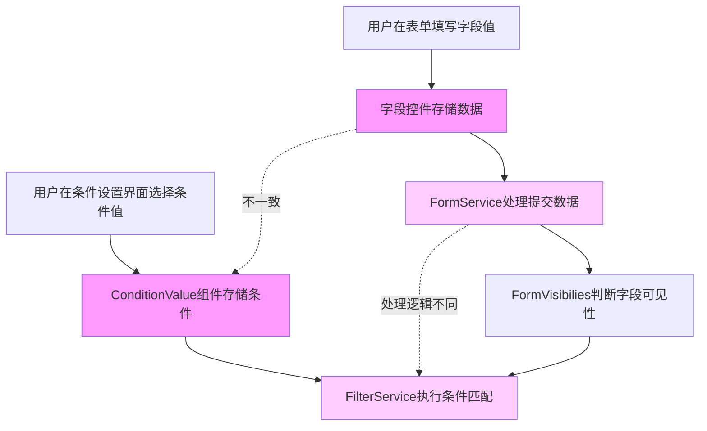
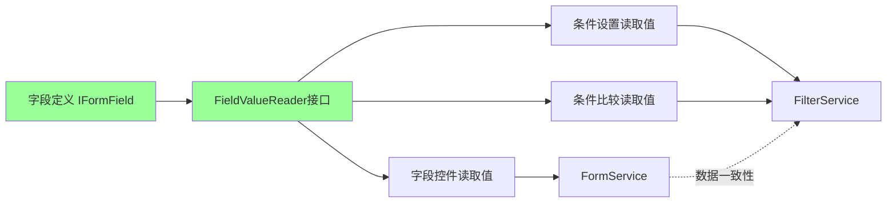
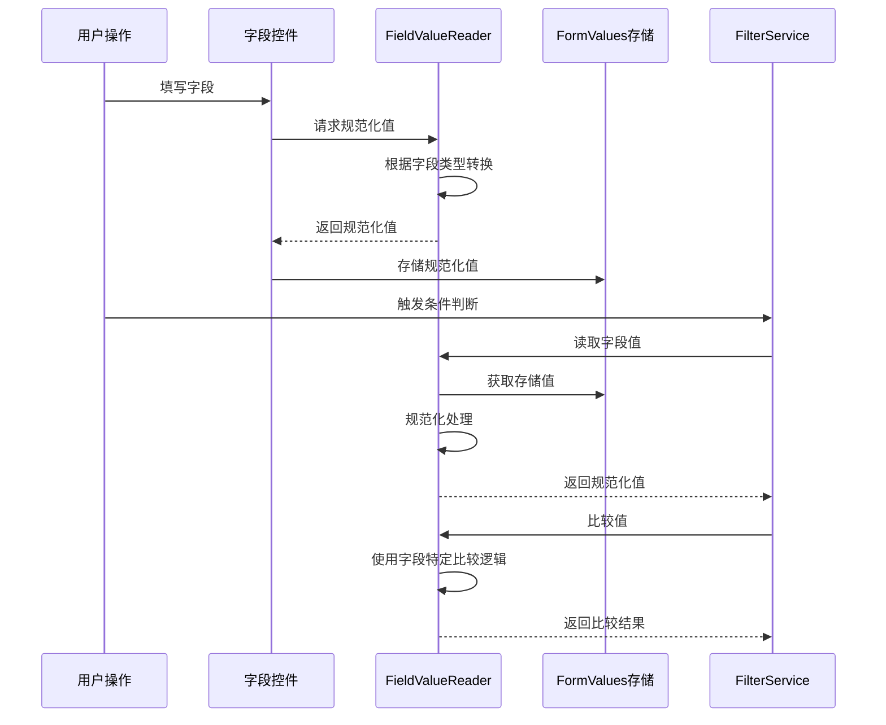
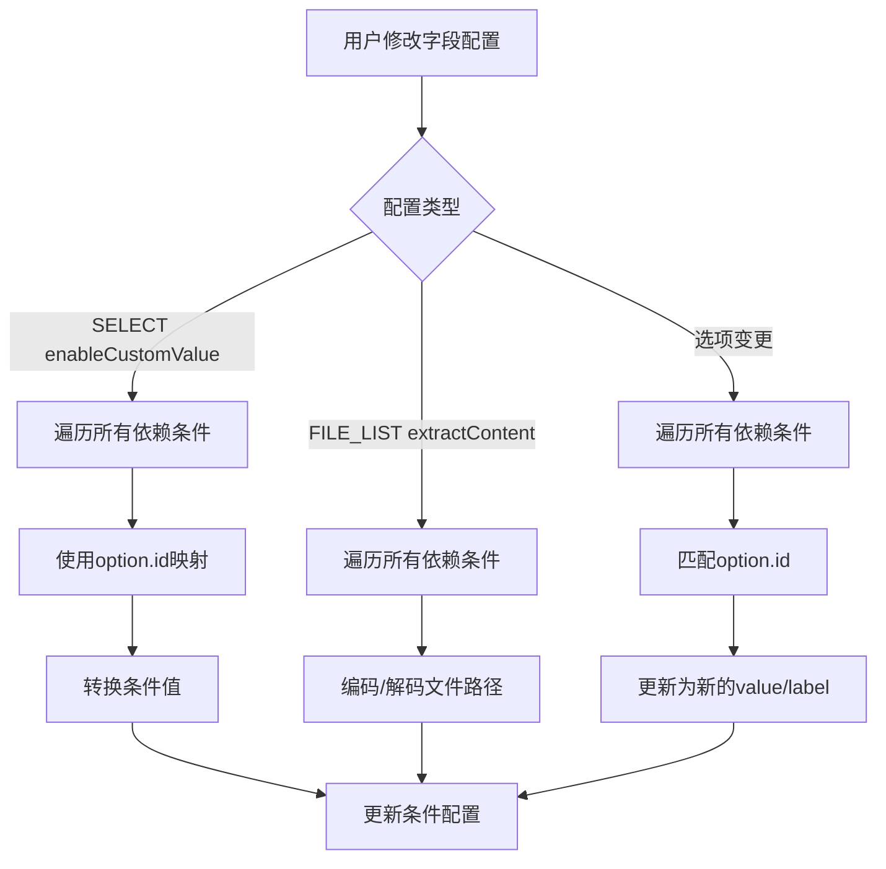
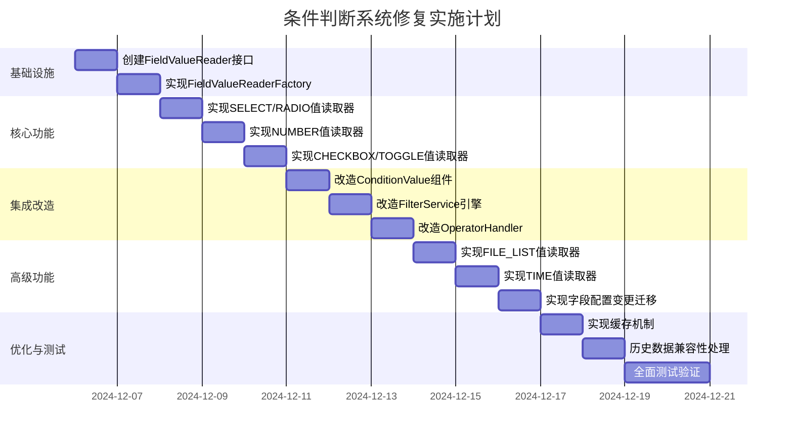

# 条件判断系统数据一致性修复设计

## 问题概述

插件的条件判断系统存在核心数据不一致问题：**字段值与条件比较值之间存在类型和格式差异，导致条件判断结果不符合预期**。

## 问题根因分析

当前系统的条件判断流程存在以下数据流转路径断裂问题：



### 核心问题点

| 序号 | 字段类型 | 数据不一致表现 | 影响范围 |
|-----|---------|--------------|---------|
| 1 | SELECT/RADIO | 字段值受enableCustomValue影响（true时存label，false时存value），但条件判断未感知此配置 | 高 |
| 2 | FILE_LIST | 启用extractContent时存储编码格式（路径+内容），条件判断直接使用未解码 | 高 |
| 3 | NUMBER | 表单存储字符串类型，条件判断期望数字类型 | 中 |
| 4 | CHECKBOX/TOGGLE | 表单存储布尔值，条件可能以字符串形式比较 | 中 |
| 5 | DATE/TIME/DATETIME | 格式化处理不统一 | 低 |

### 现有代码问题分析

#### SELECT/RADIO字段值处理不一致

**字段控件层面**（SelectControl.tsx 第16行）：
- 根据`enableCustomValue`配置决定使用`option.value`还是`option.label`
- 逻辑：`enableCustomValue === true ? o.value : o.label`

**条件设置层面**（ConditionValue.tsx 第69-73行）：
- 复用SelectControl组件，继承了相同的值处理逻辑
- **问题**：条件设置时和表单填写时使用相同的字段定义，但条件值的存储和比较未考虑后续字段配置变更

**条件比较层面**（FilterService.ts 第41-44行）：
- 直接使用`getFieldValue()`和`getValue()`获取的原始值进行比较
- **问题**：未考虑字段类型特性，简单使用`===`比较

**字段更新处理**（CpsFormFields.tsx 第171-217行）：
- 存在条件值更新逻辑，但仅处理SELECT字段option变更
- **缺陷**：未处理`enableCustomValue`配置变更的情况

#### FILE_LIST字段编码格式不统一

**字段存储层面**（FileListControl.tsx 第17-31行）：
- 使用特殊分隔符编码：`<<<FILE_PATH>>>{path}<<<CONTENT>>>{content}`
- 启用`extractContent`时将路径和内容打包存储

**条件设置层面**（ConditionValue.tsx 第76-84行）：
- 使用CpsFormFieldControl，会复用FileListControl
- **问题**：条件值也会被编码存储

**条件比较层面**（FilterService.ts）：
- 直接比较编码后的字符串
- **问题**：比较的是整个编码字符串（路径+内容），而非用户意图的文件路径

#### NUMBER字段类型转换缺失

**字段控件层面**（CpsFormFieldControl.tsx 第52-64行）：
- HTML input type="number"，onChange接收`e.target.value`（字符串类型）
- 未进行类型转换，直接传递字符串

**条件比较层面**（GtOperatorHandler.ts 第16行）：
- 直接使用`>`比较符
- **问题**：JavaScript字符串比较规则与数字比较规则不同（"9" > "10" 为true）

#### CHECKBOX/TOGGLE字段类型混用

**字段默认值层面**（getFieldDefaultValue.ts 第53-58行）：
- 返回布尔类型：`return curr.defaultValue ?? false`

**字段控件层面**（ToggleControl.tsx 第23行）：
- Obsidian ToggleComponent返回布尔值

**条件比较层面**（EqOperatorHandler.ts 第19行）：
- 使用严格相等`===`比较
- **问题**：true !== "true"

## 修复设计方案

### 设计原则

采用**单一数据源架构**，确保条件判断系统使用的数据格式与字段实际存储的数据格式完全一致。



### 架构设计

#### 核心接口定义

创建统一的字段值读取和比较接口，消除各模块间的数据格式差异：

| 接口方法 | 职责 | 输入 | 输出 |
|---------|------|------|------|
| getFieldValue | 从原始值中提取字段实际存储的值 | 字段定义、原始值 | 规范化后的值 |
| getFieldOptions | 获取字段的可选值列表（用于条件设置） | 字段定义 | Option数组 |
| compareValues | 使用字段特定逻辑比较两个值 | 字段定义、值1、值2 | 布尔结果 |
| normalizeValue | 将任意值转换为字段期望的类型 | 字段定义、任意值 | 规范化后的值 |

#### 数据流转设计



### 实施计划

#### 阶段一：创建字段值读取器基础设施

**位置**：`plugin/src/service/field-value/`

**文件结构**：
```
field-value/
├── FieldValueReader.ts          # 核心接口定义
├── readers/
│   ├── BaseFieldValueReader.ts  # 基础实现（通用字段）
│   ├── SelectFieldValueReader.ts    # SELECT/RADIO字段
│   ├── NumberFieldValueReader.ts    # NUMBER字段
│   ├── BooleanFieldValueReader.ts   # CHECKBOX/TOGGLE字段
│   ├── FileListFieldValueReader.ts  # FILE_LIST字段
│   └── TimeFieldValueReader.ts      # DATE/TIME/DATETIME字段
└── FieldValueReaderFactory.ts   # 工厂类，根据字段类型创建Reader
```

**核心接口设计**：

| 接口 | 方法签名 |
|-----|---------|
| FieldValueReader | `getFieldValue(field: IFormField, rawValue: any): any` |
| FieldValueReader | `normalizeValue(field: IFormField, value: any): any` |
| FieldValueReader | `compareValues(field: IFormField, value1: any, value2: any): boolean` |
| FieldValueReader | `getFieldOptions(field: IFormField): Option[]` |

#### 阶段二：实现各字段类型的值读取器

##### SELECT/RADIO字段值读取器

**核心逻辑**：
- `getFieldValue`：根据`enableCustomValue`返回value或label
- `normalizeValue`：确保值在options范围内
- `compareValues`：考虑多选情况，支持数组比较
- `getFieldOptions`：返回选项列表，值类型与`enableCustomValue`一致

**处理细节**：

| 场景 | enableCustomValue | 存储值 | 条件比较值 |
|-----|-------------------|--------|-----------|
| 单选 | true | option.value | option.value |
| 单选 | false | option.label | option.label |
| 多选 | true | [option.value, ...] | [option.value, ...] |
| 多选 | false | [option.label, ...] | [option.label, ...] |

**字段配置变更处理**：
- 监听`enableCustomValue`变更
- 自动迁移现有条件值（从value转label或反向）
- 使用option.id作为稳定标识符追踪选项变更

##### NUMBER字段值读取器

**核心逻辑**：
- `getFieldValue`：将字符串转换为数字类型
- `normalizeValue`：处理空值、NaN、Infinity等边界情况
- `compareValues`：确保两边都是数字后再比较
- 边界值处理规则：

| 输入值 | 转换结果 | 说明 |
|-------|---------|------|
| "123" | 123 | 正常转换 |
| "" | 0 | 空字符串视为0 |
| "abc" | NaN → null | 非法数字返回null |
| null/undefined | null | 保持null语义 |

##### CHECKBOX/TOGGLE字段值读取器

**核心逻辑**：
- `getFieldValue`：统一返回布尔类型
- `normalizeValue`：支持多种布尔值表示形式转换
- `compareValues`：布尔值直接比较

**类型转换规则**：

| 输入值 | 转换结果 |
|-------|---------|
| true | true |
| false | false |
| "true" | true |
| "false" | false |
| 1 | true |
| 0 | false |
| 其他 | false |

##### FILE_LIST字段值读取器

**核心逻辑**：
- `getFieldValue`：根据`extractContent`配置解码或保持原值
- `normalizeValue`：统一文件路径格式（反斜杠转正斜杠）
- `compareValues`：比较文件路径而非编码内容
- `getFieldOptions`：返回文件列表，受`folderPath`限制

**编码解码处理**：

| extractContent | 存储格式 | 条件比较值 |
|----------------|---------|-----------|
| true | `<<<FILE_PATH>>>{path}<<<CONTENT>>>{content}` | 解码后的path |
| false | 文件路径或内链 | 原始路径 |

**文件路径规范化**：
- 统一使用正斜杠分隔符
- 移除尾部斜杠
- 大小写敏感性根据操作系统自适应

##### TIME字段值读取器

**核心逻辑**：
- `getFieldValue`：根据字段类型返回标准化的时间字符串
- `normalizeValue`：统一时间格式
- `compareValues`：转换为时间戳后比较

**时间格式标准化**：

| 字段类型 | 标准格式 | 示例 |
|---------|---------|------|
| DATE | YYYY-MM-DD | 2024-12-06 |
| TIME | HH:mm:ss | 14:30:00 |
| DATETIME | YYYY-MM-DDTHH:mm:ss | 2024-12-06T14:30:00 |

#### 阶段三：改造条件设置组件

**修改文件**：`plugin/src/view/shared/filter-content/ConditionValue.tsx`

**改造要点**：

| 改造项 | 当前实现 | 目标实现 |
|-------|---------|---------|
| 值存储 | 直接使用控件返回值 | 使用FieldValueReader规范化后存储 |
| 值显示 | 使用原始值 | 使用Reader解码后显示 |
| 值类型 | 混合类型 | 统一为字段期望类型 |

**组件行为变更**：
- SELECT/RADIO：根据字段的`enableCustomValue`动态调整选项值
- NUMBER：输入控件直接存储数字类型
- FILE_LIST：显示路径而非编码字符串，支持路径比较和内容比较两种模式
- CHECKBOX/TOGGLE：存储布尔值

#### 阶段四：改造条件判断引擎

**修改文件**：`plugin/src/service/filter/FilterService.ts`

**核心改造**：

**当前逻辑**：
```
获取字段值（原始） → 获取条件值（原始） → 直接比较
```

**改造后逻辑**：
```
获取字段定义 → FieldValueReader规范化字段值 → FieldValueReader规范化条件值 → 使用Reader比较
```

**修改要点**：

| 修改点 | 说明 |
|-------|------|
| 增加字段定义参数 | FilterService.match()方法新增fieldDefinitions参数 |
| 引入FieldValueReaderFactory | 根据字段类型获取对应的Reader |
| 值规范化处理 | 在比较前对两边的值都进行规范化 |
| 比较逻辑委托 | 使用Reader的compareValues而非直接比较 |

**FormVisibilies改造**：

修改`FormVisibilies.visibleFields()`方法，传递字段定义列表到FilterService

**接口变更影响评估**：

| 调用位置 | 当前调用 | 需要修改 |
|---------|---------|---------|
| FormVisibilies.visibleFields | 是 | 传递fields参数 |
| 条件设置界面 | 否 | 无影响 |

#### 阶段五：改造操作符处理器

**修改文件夹**：`plugin/src/service/filter/handler/`

**改造策略**：
- 增加`OperatorHandleContext`，包含字段定义信息
- 操作符处理器接收context，使用FieldValueReader预处理值
- NUMBER相关操作符确保数值类型比较

**修改文件清单**：

| 文件 | 改造内容 |
|-----|---------|
| OperatorHandler.ts | 增加context参数传递字段定义 |
| common/EqOperatorHandler.ts | 使用Reader的compareValues |
| number/GtOperatorHandler.ts | 确保数值类型 |
| number/LtOperatorHandler.ts | 确保数值类型 |
| list/ContainsOperatorHandler.ts | 支持FILE_LIST路径比较 |

#### 阶段六：字段配置变更自动迁移

**目标**：当字段配置变更时，自动更新依赖该字段的条件值

**实现位置**：扩展`plugin/src/view/edit/setting/field/CpsFormFields.tsx`

**迁移场景**：

| 变更类型 | 迁移逻辑 |
|---------|---------|
| SELECT的enableCustomValue变更 | 根据option.id映射，从value转label或反向 |
| FILE_LIST的extractContent变更 | 重新编码或解码现有值 |
| NUMBER字段类型变更 | 转换为数字类型 |
| 选项列表变更 | 使用option.id匹配，更新为新的value/label |

**迁移流程**：



#### 阶段七：数据缓存机制

**目标**：避免重复的字段值规范化计算

**缓存策略**：

| 缓存内容 | 缓存键 | 失效时机 |
|---------|-------|---------|
| 字段值规范化结果 | `${fieldId}:${rawValue}` | 表单值变更 |
| 字段选项列表 | `${fieldId}:options` | 字段配置变更 |
| FieldValueReader实例 | `${fieldType}` | 不失效（单例） |

**缓存实现**：
- 使用WeakMap避免内存泄漏
- 表单提交后清除缓存
- 字段配置变更时清除相关缓存

#### 阶段八：历史数据兼容性处理

**兼容性问题**：
- 旧版本条件可能存储了不规范的值类型
- FILE_LIST字段的编码格式可能不一致
- NUMBER字段可能混用字符串和数字

**兼容性处理策略**：

| 问题类型 | 检测方法 | 处理方法 |
|---------|---------|---------|
| 字符串类型的NUMBER条件值 | `typeof value === 'string'` | 自动转换为数字 |
| 未编码的FILE_LIST条件值 | 不包含分隔符 | 视为路径处理 |
| 字符串类型的布尔值 | `value === "true"` | 转换为布尔类型 |

**迁移工具**：
- 提供一次性迁移函数，在插件加载时执行
- 记录迁移日志便于调试
- 支持降级回退到兼容模式

### 数据结构设计

#### FieldValueReader接口

```
接口名称：FieldValueReader

方法1：getFieldValue
  - 参数：field (IFormField), rawValue (any)
  - 返回：any
  - 说明：从原始值中提取字段实际存储的值

方法2：normalizeValue
  - 参数：field (IFormField), value (any)
  - 返回：any
  - 说明：将任意值规范化为字段期望的类型

方法3：compareValues
  - 参数：field (IFormField), value1 (any), value2 (any)
  - 返回：boolean
  - 说明：使用字段特定逻辑比较两个值是否相等

方法4：getFieldOptions
  - 参数：field (IFormField)
  - 返回：Option数组
  - 说明：获取字段的可选值列表（用于条件设置界面）
```

#### FieldValueReaderFactory类

```
类名：FieldValueReaderFactory

静态方法：getReader
  - 参数：fieldType (FormFieldType)
  - 返回：FieldValueReader实例
  - 说明：根据字段类型返回对应的Reader实例（单例模式）

私有静态属性：readerCache
  - 类型：Map<FormFieldType, FieldValueReader>
  - 说明：缓存Reader实例
```

#### OperatorHandleContext接口增强

```
接口名称：OperatorHandleContext

新增属性：fieldDefinition
  - 类型：IFormField | undefined
  - 说明：当前比较的字段定义

新增属性：valueReader
  - 类型：FieldValueReader | undefined
  - 说明：字段值读取器实例
```

### 测试验证计划

#### 单元测试覆盖

| 测试模块 | 测试用例数 | 覆盖场景 |
|---------|-----------|---------|
| SelectFieldValueReader | 12 | enableCustomValue的true/false，单选/多选，选项变更 |
| NumberFieldValueReader | 8 | 数字/字符串，空值，NaN，边界值 |
| BooleanFieldValueReader | 6 | 布尔值，字符串布尔值，数字布尔值 |
| FileListFieldValueReader | 10 | 编码/解码，路径规范化，多文件 |
| TimeFieldValueReader | 9 | DATE/TIME/DATETIME，格式转换，时区 |

#### 集成测试场景

| 场景编号 | 测试场景 | 预期结果 |
|---------|---------|---------|
| IT-01 | SELECT字段enableCustomValue为true，条件判断使用value | 条件匹配正确 |
| IT-02 | SELECT字段enableCustomValue为false，条件判断使用label | 条件匹配正确 |
| IT-03 | SELECT字段enableCustomValue变更，自动迁移条件值 | 迁移后条件仍然有效 |
| IT-04 | NUMBER字段，字符串"123"与数字123比较 | 比较结果相等 |
| IT-05 | CHECKBOX字段，true与"true"比较 | 比较结果相等 |
| IT-06 | FILE_LIST字段，extractContent=true，比较文件路径 | 正确解码后比较路径 |
| IT-07 | 多个字段组合条件，AND逻辑 | 所有条件都正确判断 |
| IT-08 | 多个字段组合条件，OR逻辑 | 任一条件正确判断 |

#### 边界情况测试

| 边界情况 | 测试方法 | 预期行为 |
|---------|---------|---------|
| 字段值为null | 各类型Reader处理null | 返回类型默认值或null |
| 字段值为undefined | 各类型Reader处理undefined | 返回类型默认值或null |
| NUMBER字段值为空字符串 | NumberFieldValueReader处理 | 转换为0或null |
| SELECT字段选项为空数组 | SelectFieldValueReader处理 | getFieldOptions返回空数组 |
| FILE_LIST字段文件不存在 | FileListFieldValueReader处理 | 返回原始路径，不报错 |

### 回归测试清单

确保修复不影响现有功能：

- [ ] 表单提交功能正常
- [ ] 字段可见性条件判断正常
- [ ] 动作条件判断正常
- [ ] 循环条件判断正常
- [ ] 字段默认值加载正常
- [ ] 多语言支持正常
- [ ] 表单导入导出功能正常

## 实施风险评估

| 风险项 | 风险等级 | 影响范围 | 缓解措施 |
|-------|---------|---------|---------|
| FilterService接口变更影响多处调用 | 高 | 条件判断全模块 | 渐进式重构，保持向后兼容 |
| 历史数据迁移失败 | 中 | 用户现有表单 | 提供兼容模式，记录迁移日志 |
| 性能影响（频繁的值规范化） | 中 | 表单渲染性能 | 实现缓存机制 |
| 边界情况处理不完整 | 中 | 特殊场景 | 全面单元测试覆盖 |
| 字段配置变更迁移逻辑复杂 | 低 | 字段编辑场景 | 详细的迁移策略设计 |

## 实施优先级

按以下顺序逐步实施，每个阶段完成后进行测试验证：



## 技术决策记录

| 决策点 | 可选方案 | 选择方案 | 理由 |
|-------|---------|---------|------|
| 值规范化时机 | 1.存储时规范化 2.读取时规范化 | 两者结合：存储时转换类型，读取时验证规范化 | 确保数据一致性，同时保持性能 |
| Reader实例管理 | 1.每次创建 2.单例模式 | 单例模式 | Reader无状态，复用实例提升性能 |
| 历史数据迁移 | 1.强制迁移 2.兼容模式 | 兼容模式+可选迁移 | 降低升级风险，用户可选择迁移时机 |
| 字段配置变更处理 | 1.自动迁移 2.提示用户手动处理 | 自动迁移+记录日志 | 提升用户体验，减少手动操作 |
| 缓存失效策略 | 1.手动失效 2.自动失效 | 自动失效+字段变更监听 | 确保数据一致性，减少人为错误 |

## 监控与验证

### 日志记录

在以下关键点添加调试日志（受debugMode控制）：

| 日志点 | 日志级别 | 记录内容 |
|-------|---------|---------|
| FieldValueReader值规范化 | debug | 字段类型、原始值、规范化后的值 |
| 条件判断比较 | debug | 字段名、字段值、条件值、比较结果 |
| 字段配置变更迁移 | info | 迁移类型、旧值、新值 |
| 历史数据兼容性处理 | warn | 检测到的不兼容数据、处理方式 |
| 缓存命中 | debug | 缓存键、是否命中 |

### 性能监控

| 监控指标 | 阈值 | 监控方法 |
|---------|------|---------|
| 单次值规范化耗时 | < 5ms | 性能标记 |
| 条件判断总耗时 | < 50ms | 性能标记 |
| 缓存命中率 | > 80% | 统计日志 |
| 表单渲染延迟增量 | < 10ms | 前后对比 |

## 文档更新

需要更新以下用户文档：

- [ ] 条件判断使用指南
- [ ] 字段类型说明文档
- [ ] FILE_LIST字段的extractContent选项说明
- [ ] SELECT/RADIO字段的enableCustomValue选项说明
- [ ] 升级指南（历史数据兼容性）

## 总结

本设计通过引入**FieldValueReader统一接口**，建立**单一数据源架构**，从根本上解决了条件判断系统的数据不一致问题。关键改进点包括：

1. **统一数据规范化**：所有字段值通过FieldValueReader进行类型转换和格式规范化
2. **类型感知比较**：条件比较时使用字段特定的比较逻辑，而非简单的相等性检查
3. **配置变更自动迁移**：字段配置变更时自动更新依赖的条件值
4. **向后兼容性**：保持对历史数据的兼容，支持渐进式迁移

修复完成后，所有字段类型的条件判断将使用与表单提交完全一致的值类型和格式，消除数据不一致导致的条件判断错误。
